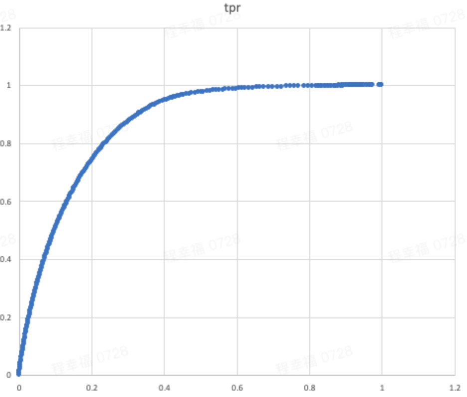

​       最近在做家庭识别模型，考虑到Spark强大的生态，选择了Spark MLlib开发和评估模型；尤其在使用它封装好的评估器BinaryClassificationMetrics时，遇到一些比较困惑的输出。经过实验得出了最佳实践，这里记录下来，需要的同学可以参考；

本文要写的一些要点：

1. 如何评价一个分类模型的好坏？分类模型有哪些指标？
2. 混淆矩阵
3. 如何利用Spark MLlib快速输出模型指标并选择最优模型？

# 分类模型评价指标

## 精确率与召回率

精确率与召回率多用于二分类问题。精确率（Precision）指的是模型判为正的所有样本中有多少是真正的正样本；召回率（Recall）指的是所有正样本有多少被模型判为正样本，即召回。设模型输出的正样本集合为AA，真正的正样本集合为BB，则有：
$$
Precision(A,B)=‖A⋂B‖/‖A‖,Recall(A,B)=‖A⋂B‖/‖B‖
$$


有时候我们需要在精确率与召回率间进行权衡，一种选择是画出精确率-召回率曲线（Precision-Recall Curve），曲线下的面积被称为AP分数（Average precision score）；另外一种选择是计算Fβ分数（即精确率和召回率的调和平均值）：
$$
Fβ=(1+β2)⋅precision⋅recall/(β2⋅precision+recall)
$$


当β=1称为F1分数，是分类与信息检索中最常用的指标之一。

## 混淆矩阵

又被称为错误矩阵，通过它可以直观地观察到算法的效果。它的每一列是样本的预测分类，每一行是样本的真实分类（反过来也可以），顾名思义，它反映了分类结果的混淆程度。混淆矩阵i行j列的原始是原本是类别i却被分为类别j的样本个数，计算完之后还可以对之进行可视化：


针对二分类，混淆矩阵


混淆矩阵我们可以得到很多指标：

**真阳性率**(**TPR**)**=TP/(TP+FN)**：实际为阳性预测也为阳性的比例。也称灵敏度(Sensitivity)、召回率（Recall）；

**假阳性率**(**FPR**)**=FP/(FP+TN)**：实际为阴性但预测为阳性的比例；

**真阴性率**(**TNR**)**=TN/(FP+TN)**：实际为阴性预测也为阴性的比例。也称为特异度（Specificity）；

**假阴性率**(**FNR**)**=FN/(TP+FN)**：实际为阳性但预测为阴性的比例；

**准确率**(**ACC**)**=(TP+TN)/(TP+FP+FN+TN)**：预测正确的比例；

**阳性预测值**(**PPV**)**=TP/(TP+FP)**：预测为阳性的结果中实际为阳性的比例。也称精准率(Precision)；

**阴性预测值**(**NPV**)**=TN/(FN+TN)**：预测为阴性的结果中实际为阴性的比例。

ROC曲线是以灵敏度为纵坐标、（1-特异度）为横坐标绘制的曲线。灵敏度（Sensitivity）即真阳性率（TPR），特异度（Specificity）即为真阴性率（TNR），（1-特异度）就是（1-TNR）=FPR，所以ROC曲线横坐标值是假阳性率（FPR），而纵坐标值是真阳性率（TPR）。

## roc

### roc空间

ROC空间是一个以伪阳性率(FPR, false positive rate)为X轴，真阳性率(TPR, true positive rate)为Y轴的二维坐标系所代表平面。

- TPR: 真阳性率，所有阳性样本中(TP+FN)，被分类器正确判断为阳的比例。
  TPR = TP / (TP + FN) = TP / 所有真实值为阳性的样本个数
- FPR: 假阳性率，所有阴性样本中(FP+TN)，被分类器错误判断为阳的比例。
  FPR = FP / (FP + TN) = FP / 所有真实值为阴性的样本个数

预测为阳的样本中，TP将产生 TPR 的收益， FP将产生FPR的成本。
  那么一个分类器的分类效果就对应ROC空间里的一个点:


### roc曲线

> 受试者工作特征曲线（receiver operating characteristic curve）简称ROC曲线，又称感受性曲线（sensitivity curve），得此名的原因在于曲线上各点反映着相同的感受性，它们都是对同一信号刺激的反应，只不过是在几种不同的判定标准下所得的结果而已。
>
> ROC曲线上各点反映的都是相同的感受性，通过对疾病组和参照组的测定结果进行分析，确定测定值的上下限、组距以及截断点，按选择的组距间隔列出累积频数分布表，并分别计算出所有截断点的真阳性率（灵敏度）、特异性和假阳性率（1-特异性），作图绘成ROC曲线。灵敏度(sensitivity)，即敏感度，是指筛检方法能将实际有病的人正确地判定为患者的比例。特异度(specificity)，是指筛检方法能将实际无病的人正确地判定为非患者的比例。

看上面的解释比较难以理解，其实它就是一个长度为1的正方形内绘制的一个曲线，横坐标是FPR，纵坐标是TPR。 显然坐标(1, 0)是所有正例全部分错，是最坏的情况，坐标(0, 1)是正例全部分对，是最好的情况，而y = x y=xy=x这条线代表了随机猜测的情况，因此正常的分类器的ROC曲线应该是高于这条直线的。




#### roc曲线中的统计量

**（1）曲线下面积（AUC）**

AUC的值来评价诊断效果，其在1.0和0.5之间。当AUC＞0.5时，AUC越接近于1，说明诊断效果越好：AUC在 0.5～0.7时，准确性较低；在0.7～0.9时，有一定准确性；AUC在0.9以上时，准确性较高。AUC＝0.5时，说明诊断方法完全不起作用，无诊断价值。AUC＜0.5不符合真实情况，在实际中极少出现。 

**（2）约登指数、灵敏度和特异度**

约登指数（Youden Index），也称正确指数，是在假定假阴性（漏诊率）和假阳性（误诊率）的危害性有同等意义时常用的方法，其反映了真正的患者与非患者的总能力。约登指数是灵敏度与特异度的和减去1，约登指数越大说明真实性越大。同时，约登指数最大值对应的检验变量值是该方法的诊断临界值。

# 如何用Spark MLliib快速输出以上指标

​        从指标介绍一节，我们发现所有指标都可以用混淆矩阵算出来，SparkMLlib也不例外，我们这里使用封装好的评估器： BinaryClassificationMetrics类。它的构造非常简单，只需把模型的预测值和对应样本实际的类别标签(例如0/1)构成的一个RDD[(Double, Double)]传给它即可:

```scala
 val predictionAndLabel: RDD[(Double, Double)]=... ...//第一列是模型输出值，第二列是对应样本实际label 
val metrics = new BinaryClassificationMetrics(predictionAndLabel)
```

那如何利用它输出模型指标呢？它有多个API分别输出不同的指标，但实际上它们是相互对应的，我们不想做选择，我们全都要。该怎么办？我们仔细观察API的名称发现都有一个后缀ByThreshold：

```scala
   // Precision by threshold
    val precision: RDD[(Double, Double)] = metrics.precisionByThreshold


    // Recall by threshold
    val recall: RDD[(Double, Double)] = metrics.recallByThreshold


    // F-measure
    val f1Score: RDD[(Double, Double)] = metrics.fMeasureByThreshold

    // AUROC
    val auROC: Double = metrics.areaUnderROC
    println(s"Area under ROC = $auROC")
```

也就是说这些API返回的RDD的第一列都是Threshold(阈值)，第二列就是对应的指标。那这就好办了，利用第一列做一个Join就OK了，如下Demo:

```scala
    val score_detail=precision
      .join(recall)
      .map(r=>{
        (r._1,(r._2._1,r._2._2))
      })
      .join(f1Score)
      .map(r=>{
        (r._1,r._2._1._1,r._2._1._2,  r._2._2).productIterator.mkString("\t")
      })
```

结果样本如下：

```sql
threshold  Precision Recall F1
6.365176629076281E-12	0.7561862960964727	0.9999614350035191	0.8611543555062915
3.097279694579637E-4	0.7291075153405294	0.8677750889405231	0.7924206040890353
6.350647369629516E-4	0.695262308975095	0.7355887428775272	0.7148572552914391
0.9721426745277615	0.008313885647607934	0.001099102399706906	0.001941532618599542
0.8430009613296399	0.035493573967733116	0.009385756018549763	0.014845766440332905
0.008071787729025235	0.3905411194254309	0.20655894177649656	0.2702051652325805
1.0795658583372632E-50	0.7561934063370321	1.0	0.8611732666896377
0.0011511886942443803	0.6517732084372543	0.6034216793127718	0.6266661660346188
0.0036471920621223993	0.5125586751800344	0.3389911396920585	0.4080861657739425
0.07184260932552915	0.188501780267587	0.07477752817655055	0.10707789585583967
0.0020346200784585634	0.59378245895366	0.47124015387433593	0.5254614013916624
```


但是，我要说但是了，如果你这么做，它输出的结果会出乎你的意料:

1. 首先是评估耗时长
2. 再就是结果集非常大，甚至和样本集一样大！ 这显然不是我们想要的。因为就算我们要画ROC曲线，那也只需要几十个点就OK了
3. 除此之外，还有一个困惑点，我们只是想要一些指标而已，它为什么会返回一个RDD？

查看了该类的源码注释:

```scala
/**
 * Evaluator for binary classification.
 *
 * @param scoreAndLabels an RDD of (score, label) or (score, label, weight) tuples.
 * @param numBins if greater than 0, then the curves (ROC curve, PR curve) computed internally
 *                will be down-sampled to this many "bins". If 0, no down-sampling will occur.
 *                This is useful because the curve contains a point for each distinct score
 *                in the input, and this could be as large as the input itself -- millions of
 *                points or more, when thousands may be entirely sufficient to summarize
 *                the curve. After down-sampling, the curves will instead be made of approximately
 *                `numBins` points instead. Points are made from bins of equal numbers of
 *                consecutive points. The size of each bin is
 *                `floor(scoreAndLabels.count() / numBins)`, which means the resulting number
 *                of bins may not exactly equal numBins. The last bin in each partition may
 *                be smaller as a result, meaning there may be an extra sample at
 *                partition boundaries.
 */
@Since("1.0.0")
class BinaryClassificationMetrics @Since("3.0.0") (
    @Since("1.3.0") val scoreAndLabels: RDD[_ <: Product],
    @Since("1.3.0") val numBins: Int = 1000)
```

通过它的源码注释，我们发现，它还有一个可选的Int型参数numBins，它是一个分箱参数，通俗的讲就是把模型输出值，也就是我们的scoreAndLabels中的第一列，分到numBins个箱子里，但最终可能不是严格的numBins个箱子，因为每个箱子的大小是这么算的:

```scala
floor(scoreAndLabels.count() / numBins)
```

向下取整，可能就需要多一个箱子才能装完。

好了， 假设我们绘制roc曲线需要20个(FPR,TPR)点，那numBins指定为20吧:

```scala
 val predictionAndLabel: RDD[(Double, Double)]=... ...//第一列是模型输出值，第二列是对应样本实际label 
val metrics = new BinaryClassificationMetrics(predictionAndLabel,numBins=20)
```

不幸的是，令人困惑的事情又发生了，输出的结果是大大减少了，但也不是20个或者21个，可能是上百个！ 

额..... , 虽然也能用，但我还是想较真儿一下，再次仔细阅读了注释，发现可能跟分区数有关，再次尝试：

```scala
 val predictionAndLabel: RDD[(Double, Double)]=... ...//第一列是模型输出值，第二列是对应样本实际label 
val metrics = new BinaryClassificationMetrics(predictionAndLabel.repartition(1),numBins=20)
```

Good!, 这样就严格输出20或者21个指标集了，而且计算速度很快！

# 总结

对模型输出值做重分区，且传入我们想要的分箱参数，通过阈值把关系的指标关联起来。

最后，我们发现全程我们不需要操心这一堆混淆矩阵如何构建，如何计算这些指标，Spark MLlib是如何做到的呢？由于篇幅有限，留做下次总结

完！
